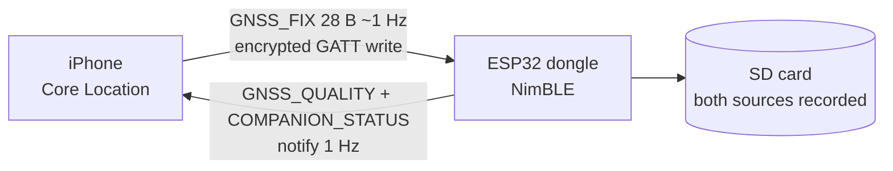

# Cairn Companion — iPhone GPS for ESP32 OBD-II Dongles over BLE

Streams your iPhone's GPS to an in-car ESP32 OBD-II data logger over Bluetooth LE, because an OBD-II port under the dash has almost no sky view. Companion to [Cairn](https://github.com/ParkWardRR/Cairn).

> **Status: design phase.** This repo holds the spec, protocol, and plan. There is no app code yet. Everything below describes what Phase 1 will build.

## Problem

The OBD-II port sits near the driver's feet. The dongle's internal GNSS receiver is behind a co-processor link under the dash, so lock is slow and `DEGRADED_GNSS` is frequent. It also reports no accuracy:

| Field in `GNSS_SAMPLE` | Internal receiver today |
|---|---|
| `h_acc_cm`, `v_acc_cm` | always `0xFFFF` (unknown) |
| `sats_visible` | always unknown |
| `source_flags` | always `0` |

A phone on the windshield or dash has a better view of the sky and reports per-fix accuracy. Whether it is actually better in your car is a Phase 1 measurement, not an assumption.

## How it works

- The phone sends a validity- and age-stamped location; the firmware back-dates it to measurement time.
- Both receivers are written as separate `GNSS_SAMPLE` frames, tagged by `source_flags` bit 5. Nothing is fused or discarded.
- The app shows firmware acceptance (last seq, accepted / rejected / dropped), so "streaming" means the device took the fix.

## Design rules

| Rule | Why |
|---|---|
| Every fix carries `sample_age_ms`, `seq`, `validity_flags` | BLE receipt time is not measurement time; cached fixes must not look fresh |
| Invalid stays invalid (`0xFFFF` sentinels, clamped accuracy) | Negative `speed` must not become 0 cm/s; negative `course` must not become north |
| Recording is source-neutral; operational choices follow an explicit policy | Event position, trip speed, and health need defined rules |
| `DEGRADED_GNSS` = internal receiver health | The phone must not mask a hardware fault |
| Locked-screen driving session in Phase 1 | A mounted phone is routinely locked or running Maps |
| All characteristics need an encrypted, authenticated link | Static passkey bonding; unbonded phones cannot inject fixes |
| No bundle format change | Only `source_flags` bit 5 is added; C, Go, Rust implementations unaffected |

## Stack

| | |
|---|---|
| App | Swift, SwiftUI, Observation, async/await, iOS 17+ |
| Location | `CLLocationUpdate.liveUpdates(.automotiveNavigation)`, `CLBackgroundActivitySession` |
| BLE (phone) | CoreBluetooth central, state restoration |
| BLE (dongle) | NimBLE-Arduino 2.2.x on ESP32 (Freematics ONE+ Model B) |
| Wire format | Little-endian fixed binary, one message type per characteristic |

## Roadmap

| Phase | Scope | Status |
|---|---|---|
| **0 — Design** | Plan, protocol v1, design review, validation matrix | ✅ done |
| **1 — GPS reinforcement (MVP)** | iOS app + firmware: `GNSS_FIX`, `GNSS_QUALITY`, `COMPANION_STATUS`, bonding, dual recording, source-aware lifecycle, locked-screen session, DB compatibility | ⏳ next |
| **2 — Enrichment** | Barometric altitude, phone UTC, compass heading, OBD + trip state notify, live dashboard | planned |
| **3 — Trips and history** | Trip history from `cairn-tsdb` over LAN, internal-vs-phone accuracy analysis, decide whether to power down internal GNSS when phone is connected | planned |

Phase 1 exit criteria are the [validation matrix](docs/validation.md): security, stale/invalid handling, drive tests, DB compatibility, and measured RAM / stack / battery / write-rate.

## Docs

| Doc | Contents |
|---|---|
| [`docs/ble-protocol.md`](docs/ble-protocol.md) | GATT service, wire layouts, sentinels, staleness, session rules |
| [`docs/firmware-changes.md`](docs/firmware-changes.md) | ESP32 changes, source state, selection policy, `source_flags`, storage |
| [`docs/ios-app.md`](docs/ios-app.md) | Stack, screen, background session, encoding rules, layout |
| [`docs/validation.md`](docs/validation.md) | Acceptance tests |
| [`docs/roadmap.md`](docs/roadmap.md) | Phase checklists |
| [`docs/decisions.md`](docs/decisions.md) | Decisions, design-review changes, open questions |
| [`docs/full-plan.md`](docs/full-plan.md) | Complete original plan document |

## Contributing

Open an issue before large changes. Protocol changes must also update the firmware repo's copy of the spec and the shared golden vectors. No secrets in the repo: passkeys and hostnames belong in the gitignored firmware `secrets.h`.

## License

[Blue Oak Model License 1.0.0](LICENSE)
