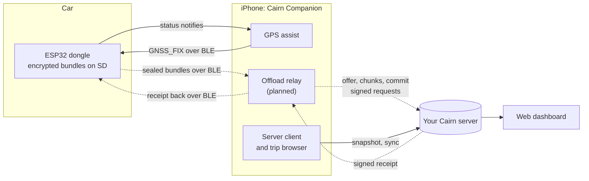
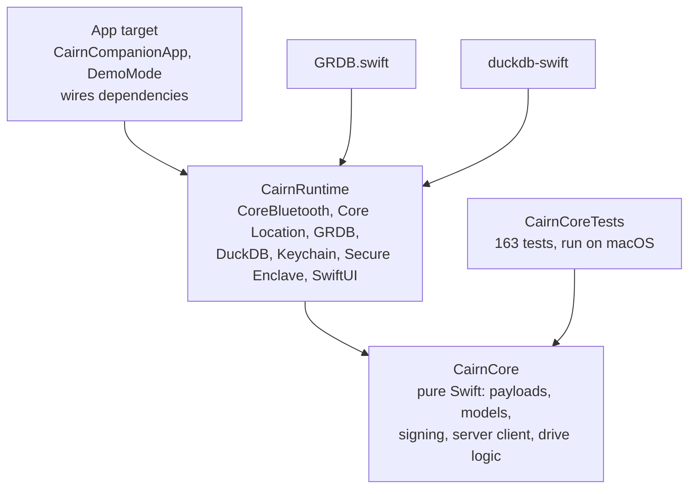
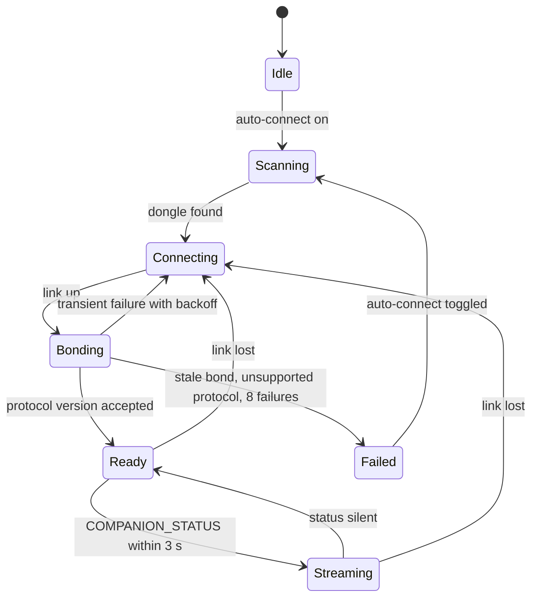
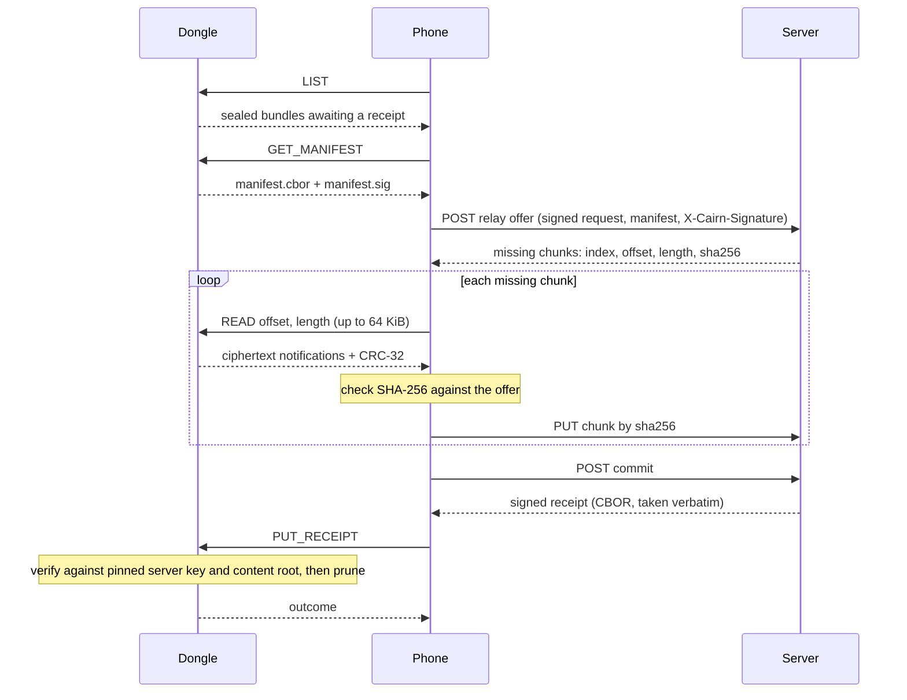
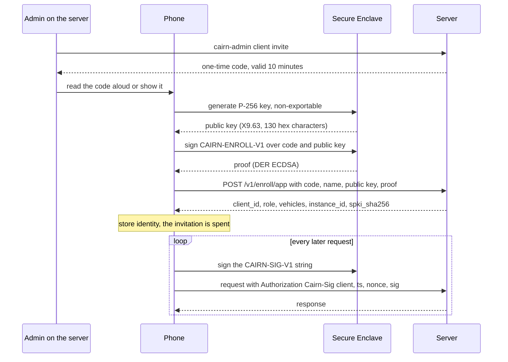
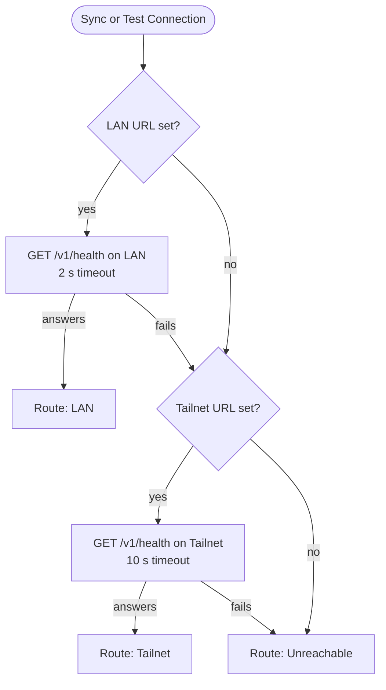
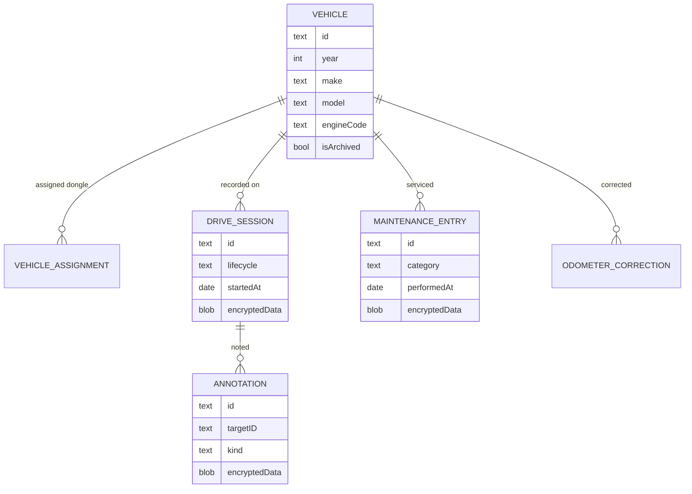

<!-- cairn-nav:start -->
<p align="center"><b>Cairn is a family of five repositories.</b> Each builds, tests and releases on its own; they agree through the shared <a href="https://github.com/ParkWardRR/cairn-driving-log-selfhosted/tree/main/contracts">contracts</a>.</p>

| Part | Repository | What it does | Stack | Docs | Issues | CI |
|---|---|---|---|---|---|---|
| Front door | [cairn-driving-log-selfhosted](https://github.com/ParkWardRR/cairn-driving-log-selfhosted) | Docs, roadmap, shared protocol contracts | Markdown · Go tools | [docs](https://github.com/ParkWardRR/cairn-driving-log-selfhosted/tree/main/docs) | [issues](https://github.com/ParkWardRR/cairn-driving-log-selfhosted/issues) | [CI](https://github.com/ParkWardRR/cairn-driving-log-selfhosted/actions) |
| Dongle | [cairn-esp32-device-firmware](https://github.com/ParkWardRR/cairn-esp32-device-firmware) | In-car recorder: OBD-II, GNSS, IMU to encrypted SD bundles | C++ · C · Rust | [docs](https://github.com/ParkWardRR/cairn-esp32-device-firmware/tree/main/docs) | [issues](https://github.com/ParkWardRR/cairn-esp32-device-firmware/issues) | [CI](https://github.com/ParkWardRR/cairn-esp32-device-firmware/actions) |
| Phone | **[cairn-ios-companion-app](https://github.com/ParkWardRR/cairn-ios-companion-app)** ◀ you are here | BLE relay, GPS assist, server client | Swift · SwiftUI | [docs](https://github.com/ParkWardRR/cairn-ios-companion-app/tree/main/docs) | [issues](https://github.com/ParkWardRR/cairn-ios-companion-app/issues) | [CI](https://github.com/ParkWardRR/cairn-ios-companion-app/actions) |
| Server | [cairn-vehicle-server](https://github.com/ParkWardRR/cairn-vehicle-server) | Verifies, decrypts, stores; serves app and dashboard | Go | [docs](https://github.com/ParkWardRR/cairn-vehicle-server/tree/main/docs) | [issues](https://github.com/ParkWardRR/cairn-vehicle-server/issues) | [CI](https://github.com/ParkWardRR/cairn-vehicle-server/actions) |
| Dashboard | [cairn-vehicle-web-dashboard](https://github.com/ParkWardRR/cairn-vehicle-web-dashboard) | Browser UI: trips, places, engine, health | Nuxt · TypeScript | [docs](https://github.com/ParkWardRR/cairn-vehicle-web-dashboard/tree/main/docs) | [issues](https://github.com/ParkWardRR/cairn-vehicle-web-dashboard/issues) | [CI](https://github.com/ParkWardRR/cairn-vehicle-web-dashboard/actions) |

<sub>Shared: [Roadmap](https://github.com/ParkWardRR/cairn-driving-log-selfhosted/blob/main/ROADMAP.md) · [Install](https://github.com/ParkWardRR/cairn-driving-log-selfhosted/blob/main/INSTALL.md) · [Architecture](https://github.com/ParkWardRR/cairn-driving-log-selfhosted/blob/main/docs/architecture.md) · [Threat model](https://github.com/ParkWardRR/cairn-driving-log-selfhosted/blob/main/docs/threat-model.md) · [Trust model](https://github.com/ParkWardRR/cairn-driving-log-selfhosted/blob/main/docs/trust-model-v3.md) · [Contracts](https://github.com/ParkWardRR/cairn-driving-log-selfhosted/tree/main/contracts) · [Archive of the original monorepo](https://github.com/ParkWardRR/cairn-original-monorepo-archive)</sub>
<!-- cairn-nav:end -->


# Cairn Companion

**The iPhone app for Cairn, a self-hosted car driving log. It lends the dongle its GPS, carries the dongle's trips to your own server, and lets you browse them offline.**

[](https://github.com/ParkWardRR/cairn-ios-companion-app/actions/workflows/test.yml)
[](LICENSE)


<p align="center">
  
  &nbsp;&nbsp;
  
</p>

> Screens are simulator renders of the Drive tab with canned data ([how they are made](#demo-mode-and-screenshots)). They predate the four-tab layout; the Drive tab cards are otherwise unchanged. The BLE link itself has run on real hardware.

## In plain language

Cairn is a small ESP32 dongle in the car's OBD-II port. It records every drive (position, speed, engine data) to an SD card, **encrypted**. Your server holds the trip history and the web dashboard shows it. Something has to carry data between the dongle and the server. That something is this app — and since 2026-10-07 the dongle can also carry trips itself over its own cellular link, which makes the phone the preferred path rather than the only one.

The app does three jobs:

1. **GPS assist.** The dongle sits low under the dash with a poor view of the sky. The phone on your windshield has a better one, so the app streams its location, with an accuracy figure for every fix, to the dongle over Bluetooth LE.
2. **Offload relay.** After a drive the phone pulls the dongle's sealed trip bundles over BLE, uploads them to your server, and hands the server's signed receipt back so the dongle can free space. The phone moves bundles it cannot read or alter. **The message codec, session and transfer checks landed 2026-10-06 (PR #32). The CoreBluetooth wiring is still open ([#14](https://github.com/ParkWardRR/cairn-ios-companion-app/issues/14)), so the app does not yet pair with the dongle; the first real over-the-air offload (nine bundles in 62 s) was carried by `cmd/cairn-phone` in the server repository, which is the reference this app matches.** See [Status](#status-and-roadmap).
3. **Server client and trip browser.** The app enrols with your server as a named client, signs every request with a key that never leaves the phone's Secure Enclave, and keeps a local copy of your trips so Trips works offline. The signing client is built and tested; wiring it into the screens is still to do.

It also works with no server at all: pairing, GPS assist, drive history, a garage with a maintenance log, and encrypted backup are all local ([standalone mode](#standalone-mode)).

## Contents

- [What the app does today](#what-the-app-does-today)
- [Architecture](#architecture)
- [BLE link and protocol](#ble-link-and-protocol)
- [The relay path](#the-relay-path-and-why-the-phone-cannot-read-or-alter-bundles)
- [Enrolment and request signing](#enrolment-and-request-signing)
- [LAN, Tailnet and standalone mode](#lan-tailnet-and-standalone-mode)
- [Local data, export and import](#local-data-export-and-import)
- [Background behaviour](#background-behaviour)
- [Privacy](#privacy)
- [Build and run](#build-and-run)
- [Testing](#testing)
- [Demo mode and screenshots](#demo-mode-and-screenshots)
- [Status and roadmap](#status-and-roadmap)
- [Docs index](#docs-index)
- [Troubleshooting](#troubleshooting)
- [FAQ](#faq)
- [Contributing](#contributing) and [License](#license)

## What the app does today

| Area | What it does | State |
|---|---|---|
| **GPS assist** | Streams Core Location fixes (about 1 Hz, `.automotiveNavigation`) to the dongle as 28-byte `GNSS_FIX` writes; shows whether the dongle actually accepted them | Running on hardware; validation matrix still open |
| **Zero-tap sessions** | Holds a pending BLE connection to your dongle. Location starts when the link is bonded and stops when it drops. No Start button | Running on hardware |
| **Link health** | Per-channel "last heard" badges (live, stale, silent), last readings kept dimmed after a drop, reconnect countdown with attempt count, link timeline, sent versus accepted bar | Built, logic tested on macOS |
| **Drive history** | Every connection session is recorded on the phone: duration, streaming share, sent / accepted / rejected / dropped, reconnects, link events. A gap over 10 minutes closes a drive; interrupted sessions are recovered after a kill | Built |
| **Trips tab** | Phone sessions plus server trips as a scrollable list grouped by day: each card shows a route sketch, distance, duration and top speed, and a tap opens the route map, headline numbers and the full detail. Vehicle / date / favourites filters, note search, inline annotation editing. A phone session and a server trip are matched when they overlap by more than half the session | Built; server trips need a server |
| **Garage** | Multiple vehicles, dongle-to-vehicle assignment, odometer corrections with a chart, a 15-category maintenance log, per-vehicle drive stats | Built |
| **Bluetooth settings** | Dongle status, a five-check troubleshooting list, connection log, BLE info, start / stop / forget dongle | Built |
| **First-run welcome** | Three plain-language pages, shown once | Built (an intro only; no enrolment step yet) |
| **Encrypted store** | SQLite (GRDB) with AES-256-GCM per-record blobs; encrypted `.cairnbackup` export and import | Built |
| **Endpoint selection** | Two server URLs (LAN, Tailnet) with probes, an active-route badge and latency | Built (probe only; see limits below) |
| **Trip snapshot sync** | Downloads a Parquet snapshot into an on-device DuckDB for offline browsing | Built against a legacy endpoint; not yet on the authenticated API |
| **Signed server client** | `CairnServerClient`: enrolment, per-request signing, bearer tokens, push, pull, ack, snapshot, relay calls, revocation | Built and vector-tested; **not yet wired into the UI** |
| **Secure Enclave identity** | `SecureEnclaveIdentity` generates and holds a P-256 signing key | Built; not yet used by any screen |
| **BLE bundle offload** | `LIST`, `GET_MANIFEST`, `READ`, `PUT_RECEIPT` over `OFFLOAD_CONTROL` / `OFFLOAD_DATA` | **Not started** ([#14](https://github.com/ParkWardRR/cairn-ios-companion-app/issues/14)) |

The four tabs are **Drive** (live session), **Trips**, **Garage** and **Settings**.

### Why the phone's GPS helps

The OBD-II port sits near the driver's feet. The dongle's receiver is behind a co-processor link under the dash, so lock is slow and `DEGRADED_GNSS` is frequent. It also reports no accuracy:

| Field in the dongle's `GNSS_SAMPLE` | Internal receiver today |
|---|---|
| `h_acc_cm`, `v_acc_cm` | always `0xFFFF` (unknown) |
| `sats_visible` | always unknown |
| `source_flags` | always `0` |

A phone on the windshield sees more sky and reports per-fix accuracy. Whether it is actually better in your car is a measurement, not an assumption; that drive test is still open. The firmware records both sources as separate frames, tagged by `source_flags` bit 5, and fuses nothing.

### Design rules the app follows

| Rule | Why |
|---|---|
| Every fix carries `sample_age_ms`, `seq` and `validity_flags` | BLE receipt time is not measurement time; a cached fix must not look fresh |
| Invalid stays invalid | Negative speed never becomes 0 cm/s, negative course never becomes north, accuracy is clamped to 65534 instead of wrapped, fixes older than 2 s are dropped before the wire |
| "Streaming" means the dongle acknowledged it | The indicator needs a `COMPANION_STATUS` notify within 3 s, not just a successful `write` |
| `DEGRADED_GNSS` is internal-receiver health | The phone must not mask a hardware fault |
| Every characteristic needs an encrypted, authenticated link | Unbonded phones can discover the dongle but cannot read, write or subscribe |
| Bundles are never deleted or discarded on the phone's authority | Only a server-signed receipt, verified by the dongle, frees dongle storage (see [relay](#the-relay-path-and-why-the-phone-cannot-read-or-alter-bundles)) |

## Architecture



Dashed arrows are the relay path, which is specified but not yet implemented in this app. The firmware and server halves of it are implemented.

### Modules

One Swift package (`CairnCompanion/Package.swift`, swift-tools 6.0, iOS 18 and macOS 15) plus a thin app target generated by XcodeGen.



| Target | Holds | Notes |
|---|---|---|
| `CairnCore` | `BLE/` (GATT profile, payload encoder and decoder, reconnect policy), `Auth/` (signing string, canonical JSON, enrolment proof, `RequestSigner`, `SoftwareSigner`), `Server/` (`CairnServerClient`, HTTP transport protocol, bearer token store, error model, sync models), `History/` (drive session, segmenter, trip snapshot), `Models/` (vehicle, maintenance, annotation, link health, throttle), `Sync/` (snapshot manifest, tar reader) | No UI, no live radio or GPS. Uses CryptoKit and CoreBluetooth, so it needs an Apple platform (see [testing](#testing)) |
| `CairnRuntime` | `BLE/CairnBLEManager`, `Location/` (live updates, barometer), `Session/` (`DrivingSession`, `SessionState`), `Store/` (GRDB database, AES-GCM, `DataPorter`), `Auth/SecureEnclaveIdentity`, `History/` (recorder, `TripSyncClient`), `Sync/` (DuckDB snapshot store), `Views/` | Needs real radios, GPS and a device for the interesting parts |
| App target (`CairnCompanion/App`) | `@main`, dependency wiring, debug-only demo mode, `Info.plist`, asset catalog | `xcodegen` produces `CairnCompanion.xcodeproj` from `project.yml` |

`CairnServerClient` knows the network only through a small `HTTPTransport` protocol, so tests serve recorded responses. The runtime has no `URLSession` implementation of it yet, which is part of what "not yet wired in" means.

## BLE link and protocol

The phone is a CoreBluetooth **central**; the dongle is the peripheral. One custom GATT service with typed characteristics, fixed little-endian binary layouts, no framing, no strings.

The normative spec is [`contracts/ble/v1/spec.md`](https://github.com/ParkWardRR/cairn-driving-log-selfhosted/blob/main/contracts/ble/v1/spec.md) in the front door, with the offload extension in [`offload.md`](https://github.com/ParkWardRR/cairn-driving-log-selfhosted/blob/main/contracts/ble/v1/offload.md). This repo keeps a readable copy in [`docs/ble-protocol.md`](docs/ble-protocol.md).

| Characteristic | Suffix | Direction | Size | App support |
|---|---|---|---|---|
| `GNSS_FIX` | `0001` | phone to dongle, write without response, about 1 Hz | 28 B | Sent; required |
| `GNSS_QUALITY` | `0010` | dongle to phone, notify 1 Hz | 8 B | Decoded, shown |
| `COMPANION_STATUS` | `0011` | dongle to phone, notify 1 Hz | 8 B | Decoded; drives "Streaming" |
| `PROTOCOL_VERSION` | `00F0` | read | 2 B | Read; accepts major version 1 only; required |
| `BARO_ALT` | `0002` | phone to dongle | 4 B | Implemented, dormant until the firmware exposes it |
| `UTC_SYNC` | `0003` | phone to dongle, on connect and each minute | 8 B | Implemented, dormant likewise |
| `OBD_LIVE` | `0020` | dongle to phone | 48 B | Decoded and shown if present |
| `DEVICE_STATUS` | `0021` | dongle to phone | 12 B | Decoded and shown if present |
| `OFFLOAD_CONTROL`, `OFFLOAD_DATA` | `0030`, `0031` | both | variable | **Not implemented in the app** |
| Device information | `0040` to `0044` | dongle to phone | variable | **Not implemented in the app** |

The service UUID is `A8E3xxxx-4F5B-11EF-A017-325096B39F47`, with a 16-bit suffix per characteristic. The app scans by service UUID only; the name `Cairn` is display-only. `PROTOCOL_VERSION` byte 1 is a capabilities bitmap (bit 2 offload, bit 3 device information). The app reads it but does not use it yet.

### Connection lifecycle



- **Bonding.** After service discovery the app reads `PROTOCOL_VERSION` and subscribes to the two notifies. The first encrypted access makes iOS ask for the dongle's static 6-digit passkey; the bond then survives reboots and reconnects are silent. The dongle holds one bond; a new phone replaces the old one. The app cannot delete an iOS bond itself.
- **Reconnect.** A dongle-initiated disconnect (engine off, standby) is a link loss, not a failure: the app ends the session, shows "Connecting" and re-issues `connect`; a pending connect completes when the dongle advertises again. Failures after a link did come up retry with backoff (1 s, doubling to 15 s) and give up after 8 consecutive attempts. Protocol refusals (unsupported version, missing required characteristics, write size under 28) are final.
- **Stale bond.** Two consecutive authentication failures on the `PROTOCOL_VERSION` read, or iOS reporting that the peer removed its pairing information, show "Stale pairing" with the re-pairing steps.
- **Write flow control.** The app checks `maximumWriteValueLength(for: .withoutResponse) >= 28` at connect, drops fixes rather than queueing stale ones when the radio is backed up, and counts them.
- **Counters** (`COMPANION_STATUS` on the dongle, sent and dropped in the app) restart on every connection so the two stay comparable. `seq` starts at 0 on every connection.

The 28-byte `GNSS_FIX` layout, sentinels, `fix_type` mapping, staleness rules (app drops over 2 s, firmware rejects over 3 s) and firmware rejection rules are in [`docs/ble-protocol.md`](docs/ble-protocol.md). The byte vectors that pin them are replayed by the tests.

## The relay path, and why the phone cannot read or alter bundles

> **Status: specified, and implemented on the firmware, on the server and in a Go reference client. The relay-path message codec, session and transfer checks landed in this app on 2026-10-06 (PR #32). The CoreBluetooth half is still open** ([#14](https://github.com/ParkWardRR/cairn-ios-companion-app/issues/14)). The server calls it needs (`relayOffer`, `relayChunk`, `relayCommit`, `relayReceipt`) are already in `CairnServerClient` and replayed against the server's recorded exchanges. The reference client (`cmd/cairn-phone` on macOS) **carried the first real over-the-air offload on 2026-10-06**: nine bundles in 62 s, nine receipts verified on the dongle and pruned. The app will replace it once #14 lands.

A trip is sealed into a **bundle**: a manifest signed by the dongle's Ed25519 key plus encrypted segments (XChaCha20-Poly1305).

The phone used to be the dongle's only way out. Since 2026-10-07 the firmware also uploads bundles itself over **LTE**, so the phone is the preferred path — free, and already connected over BLE — rather than the only one. That changes nothing about this app's job or its security properties: the dongle still signs, the phone still cannot read or forge a bundle, and only a receipt signed by the server authorises deleting a trip from the card. It does mean a trip can reach the server without the phone, so the app should not assume it is the sole carrier. (Wi-Fi is implemented in the firmware but switched off in production, because it cannot associate while the BLE controller is up — see firmware issue #31.)

| | The phone | The server | The dongle |
|---|---|---|---|
| Can read trip data | **No.** It carries ciphertext only, under a key it never sees | Yes (holds the escrowed storage root) | Yes |
| Can make the dongle delete a bundle | **No.** Only a receipt signed by the server key **pinned in the firmware**, naming that bundle's content root | Issues the receipt | Verifies it, then prunes |
| Can corrupt a bundle in transit | Not undetectably: the server checks every chunk's SHA-256 against the device-signed manifest, and the manifest signature against the enrolled device | Rejects bad chunks and manifests | n/a |
| Can see metadata (sizes, counts, times) | Yes, from the manifest | Yes | Yes |

So the phone is trusted for **availability only**. A malicious or buggy phone can fail to upload; it cannot lose data, forge a receipt or read a trip. That is why the BLE link needs only the bond and passkey and no second signature scheme (a challenge-response using the enrolled app key is a planned hardening, [#9](https://github.com/ParkWardRR/cairn-ios-companion-app/issues/9)).



What the phone must do, in the contract's terms:

- **Resumable and idempotent.** The server's offer says which chunks it still wants; a retry re-reads only those. A receipt re-fetched with `GET .../receipt` is byte-identical. Nothing is deleted on the dongle until `PUT_RECEIPT` succeeds.
- **Pass the receipt through untouched.** Its signature covers the exact bytes; the phone never parses or edits it.
- **Retry later on `TRIP_ACTIVE`.** The dongle refuses transfers while a trip is in progress, because capture owns the SD card's bus. A bundle only exists once sealed, after the trailing dwell.
- **Negotiate an MTU of at least 43** before the first request (target 247, a 15 to 30 ms connection interval, roughly 10 to 25 KB/s; a 1 MB drive takes about a minute).
- **Surface, do not retry, a rejected receipt** (outcomes 2 to 4: bad signature, wrong content root, no pinned key). That means the server's key and the firmware's pinned key disagree; the bundle is safe on the dongle.
- **Treat `401 bad_manifest_signature` as a problem with the bundle**, not a revoked client or a clock error. `CairnServerError.badManifestSignature` is separate from `.unauthenticated` for this reason.

The dongle advertises while awake, stays up through its idle dwell, and will not enter standby while an offload session is open or bundles are pending and a phone is connected. In standby it wakes only on engine start or its six-hourly heartbeat, so the phone should connect as soon as it sees the service after a drive.

### Where the dongle is heading

The owner has decided the dongle regains Wi-Fi and LTE (see "Direction changes since the split" in the [front-door ROADMAP](https://github.com/ParkWardRR/cairn-driving-log-selfhosted/blob/main/ROADMAP.md)). The device uplink contract (`uplink/v1`) is a draft with no implementation yet. BLE stays the dongle's home state and this app stays a path for bundles and instructions; the app is also meant to provision Wi-Fi and LTE settings and show LTE usage ([#28](https://github.com/ParkWardRR/cairn-ios-companion-app/issues/28), [#30](https://github.com/ParkWardRR/cairn-ios-companion-app/issues/30)). None of that exists in the app. Older documents in this repo that describe a post-trip Wi-Fi handover predate the no-Wi-Fi decision for the shipped firmware.

## Enrolment and request signing

> **Status: the cryptography and the client are built and checked against the server's vectors. No screen drives enrolment yet**, so a build of the app does not currently enrol with a server on its own. The first-run welcome flow is an intro only.

Reaching your server over a Tailnet is not a credential. Every request is **signed** with a P-256 key held in the Secure Enclave, so there is no password, no long-lived token in a config file, and no mTLS (Tailscale Serve terminates TLS, so a client certificate could never reach the server on that path; [decision 12](docs/decisions.md)).



The signature covers seven `\n`-joined lines, no trailing newline: `CAIRN-SIG-V1`, method, request target exactly as sent (path plus query), unix timestamp, a fresh 16-byte nonce as 32 hex characters, the SHA-256 of the body in lowercase hex, and the client id. Details that matter:

- The server accepts a clock within about 120 seconds, and each nonce once. The client builds a fresh header for every attempt, including network retries.
- Every authentication failure is the same `401 unauthenticated`, deliberately, so a probe learns nothing. The client does not guess whether it was a revocation, replay or clock problem; `403` is "authenticated but refused" (scope, admin, funnel, Tailnet identity).
- **Bearer tokens** (`POST /v1/auth/token`, valid one hour, only for sync and relay routes) exist so a background `URLSession` task created ahead of time can still authenticate. The token store is a protocol with an in-memory implementation; a Keychain-backed one is not written yet.
- A **replacing invitation** enrols a new key and revokes the old one in one server write, which is how a restored or replaced phone recovers.
- Operations pushed to the server carry a `content_hash` over a **canonical JSON** form (sorted keys, integers only, no floats). `CanonicalJSON` implements it and is tested.

`SoftwareSigner` is the stand-in used by tests and any non-device build; `SecureEnclaveIdentity` needs a physical iPhone (the simulator has no Secure Enclave). The key is kept with `AfterFirstUnlockThisDeviceOnly` and is not gated on Face ID.

**Two different "passkeys."** The *BLE passkey* is the static 6-digit pairing code compiled into the dongle firmware. It has nothing to do with sign-in. The owner's requirement for people signing in to the server and web dashboard is to support **both** a WebAuthn passkey and Tailnet identity; that lives in the server and dashboard repos. This app authenticates as a machine client with its enrolled key and is not part of that sign-in.

Server API surface in `CairnServerClient` (all in `CairnCore`, all unit-tested): `health`, `enrol`, `mintToken`, `push`, `pull` (reports `410 cursor_reset` as an outcome, not an error), `ack`, `snapshot`, `relayOffer`, `relayChunk`, `relayCommit`, `relayReceipt`, `revokeClient`, `revokeDevice`. The protocol is [`contracts/sync/v1/spec.md`](https://github.com/ParkWardRR/cairn-driving-log-selfhosted/blob/main/contracts/sync/v1/spec.md) (status: draft until the app and the server both implement it and an independent consumer has validated the vectors).

## LAN, Tailnet and standalone mode

### Endpoint selection

Settings holds **two** URLs for one logical server: a **LAN** URL and a **Tailnet** URL. At home the LAN is faster; away from home a Tailnet reaches the same server without exposing it to the internet.



- Detection is a **plain HTTP probe**, not Wi-Fi SSID matching, so it needs no `NEHotspotNetwork` entitlement and works on any network ([decision 16](docs/decisions.md)).
- Settings shows the active route, each probe's latency or error, and a **Test Connection** button that probes both at once. It is one account on one server; the app never keeps separate state per route.
- **Not yet enforced, though the spec requires it:** comparing the `instance_id` from both routes with the one stored at enrolment (a mismatch should stop, because it is a different server), and pinning the LAN certificate's SPKI hash. Today the probe records the `instance_id` but does not compare it, and the connection uses the system trust store. The Tailnet certificate is validated normally. Do not point the LAN URL at a server you do not trust.
- The app does not assume Tailscale is up in the background. Tailscale is a route preference, not a correctness dependency; a durable outbox and background transfers are the planned shape ([#5](https://github.com/ParkWardRR/cairn-ios-companion-app/issues/5)).

### Standalone mode

With no URL set, Settings shows **Standalone Mode** and the Sync controls disappear. Everything local keeps working: pairing, GPS assist, link health, drive history, Garage (vehicles, odometer, maintenance), annotations, encrypted export and import. Connect a server later from Settings, with no reset.

## Local data, export and import

The app's own data lives in one SQLite database (GRDB). Index columns are plaintext so lists stay fast; the payload of each row is an **AES-256-GCM** blob under a 256-bit key held in the Keychain (`AfterFirstUnlockThisDeviceOnly`).



The schema also reserves `outbox`, `syncState`, `tripSummary` and `enrolment` tables for the sync engine and enrolment; **nothing reads or writes them yet**.

### Encrypted export and import

**Settings > Data > Export Data** asks for a passphrase and produces a `.cairnbackup` file you can share or save. **Import Data** reads one back with the same passphrase.

| | |
|---|---|
| Contents | Vehicles, dongle assignments, maintenance entries, odometer corrections, annotations (JSON, version 1) |
| Not included | Drive sessions; they are phone-observed and trips re-sync from the server |
| Format | 32-byte random salt, then an AES-256-GCM sealed box (nonce, ciphertext, tag) |
| Key | HKDF-SHA256 over the SHA-256 of the passphrase, with the salt and the info string `cairn-backup-v1` |
| Wrong passphrase | Reported as "Wrong passphrase"; a file that is not a Cairn backup is rejected |

There is **no slow key-derivation step** (no PBKDF2, scrypt or Argon2), so the file's protection is only as strong as the passphrase. Use a long, random one and keep the file off shared storage.

## Background behaviour

A windshield-mounted phone is routinely locked or running Maps, and the app is usually "launched" by the car powering the dongle, not by you.

- **Declared modes:** `location` and `bluetooth-central`.
- **Waiting costs no location.** While auto-connect is on the app holds a pending `connect` to the bonded dongle (or scans by service UUID before the first bond). Location runs only while the link is up.
- **State restoration:** the central manager uses a restore identifier, and the app does its own reconnect logic rather than assuming iOS will relaunch it. A **force-quit app is not relaunched by iOS**.
- **Location authorisation:** the app asks for **Always**, because starting location from a background BLE wake needs it; While In Use only covers a foregrounded start.
- **Throttle:** about 1 Hz out, with extras dropped; iOS delivers roughly every 6 s when stationary, and the firmware's 3 s staleness window rejects those, which is fine while parked.
- **Open item:** `CLBackgroundActivitySession` is created only when the dongle reports OBD data or a driving state (`OBD_LIVE`, `DEVICE_STATUS`), which the shipped firmware does not expose yet. Whether location keeps streaming through a locked screen on current firmware, and BLE wake from suspended and from system-terminated, are open rows of the [validation matrix](docs/validation.md).
- **Not built yet:** background `URLSession` transfers, `BGAppRefreshTask` and `BGProcessingTask` for sync and offload, widgets and Live Activities ([CarPlay decision](docs/carplay-design.md)).

## Privacy

- **No accounts, no cloud, no analytics.** The app talks to the dongle over BLE and, if you configure one, to your own server. There is no third-party service.
- **The phone cannot read your trips** when relaying: it carries ciphertext (see [relay](#the-relay-path-and-why-the-phone-cannot-read-or-alter-bundles)). What the phone does see on the live link is its own GPS, plus the dongle's status, optional OBD readings and device health.
- **Server URLs are stored on the device only** (`UserDefaults`) and never committed. Docs use `cairn.example.lan` as a placeholder.
- **At rest:** per-record AES-256-GCM with the key in the Keychain (this device only); the database directory and the snapshot cache are excluded from backups; the data directories use the `completeUntilFirstUserAuthentication` protection class so background writes work with the phone locked.
- **Logs are hygiene-checked:** request and response types print only the method or status, never headers, targets, cursors or bodies; error values carry no tokens, signatures or URLs. The shareable `cairn-drive.log` (visible in the Files app) holds link events and counters, and must never hold tokens, signatures, request bodies, coordinates, SSIDs, a full VIN or an invitation code.
- **Permissions requested:** Bluetooth, Location (Always and While In Use) and Motion (the barometer, for the optional relative altitude).
- **What the dongle's own security rests on** (flash and NVS encryption, the pinned receipt key, enrolment) is firmware and server territory. See the [threat model](https://github.com/ParkWardRR/cairn-driving-log-selfhosted/blob/main/docs/threat-model.md).

## Build and run

You need Xcode 16 or later (Swift 6), an iPhone on iOS 18 or later (BLE does not run in the simulator), [XcodeGen](https://github.com/yonaskolb/XcodeGen), and a dongle running the [Cairn firmware](https://github.com/ParkWardRR/cairn-esp32-device-firmware) with `CAIRN_BLE_COMPANION`.

```sh
cd CairnCompanion
cp Config/Local.xcconfig.example Config/Local.xcconfig   # then edit it
xcodegen generate
open CairnCompanion.xcodeproj
```

`Config/Local.xcconfig` is gitignored and holds your own signing values (placeholders shown):

```
CAIRN_BUNDLE_ID = com.example.cairncompanion
CAIRN_TEAM_ID   = YOURTEAMID
```

The bundle ID must be unique to your Apple Developer account. `Config/Base.xcconfig` carries the committed defaults and includes `Local.xcconfig` if it exists. Re-run `xcodegen generate` after editing `project.yml`.

On first launch:

1. Read the welcome pages, then grant **Bluetooth** and **Location**. Choose **Always** when asked (needed to stream from a background BLE wake).
2. The first read of an encrypted characteristic makes iOS ask for the dongle's **6-digit passkey**. After that, reconnects are silent.
3. Add a vehicle in **Garage** and assign your dongle to it.
4. For Trips from a server, enter your LAN and/or Tailnet URL under **Settings**.

If the dongle's bond is ever reset, forget "Cairn" under iOS Settings > Bluetooth first.

## Testing

```sh
scripts/fetch-contracts.sh          # fetch the pinned contracts into .contracts/ (git-ignored)
cd CairnCompanion && swift test     # 163 test functions, all in CairnCore
```

`swift build` produces a macOS debug build of both libraries. The tests need no radio, GPS or iPhone.

> **macOS only.** `CairnCore` uses CryptoKit and CoreBluetooth and the package declares iOS 18 / macOS 15, so `swift test` needs a Mac with Xcode. It will not run in a Linux container.

### Contract vector replay

Nothing from the contracts is vendored. `contracts.lock` pins a release by repository, tag (`contracts-v0.2.0`) **and** commit; `scripts/fetch-contracts.sh` refuses a tag that no longer resolves to that commit. The tests read the vectors from `.contracts/contracts/`. Set `CAIRN_CONTRACTS=<dir>` to point at a local checkout when a contract and this app change together; `--release` refuses an override or a dirty tree. Bumping the pin is the only way the vectors change.

| Vectors | Replayed by | What is checked |
|---|---|---|
| `ble/v1` golden vectors | `GoldenVectorTests` | `GNSS_FIX`, `BARO_ALT` and `UTC_SYNC` bytes match an independent Python implementation, including sentinels, clamping and course wrap |
| `sync/v1` signing vectors | `SyncSigningVectorTests` | Signing string, body hash and `Authorization` header are byte-exact; recorded and fresh signatures verify under the test key; the enrolment proof message |
| `sync/v1` exchanges (83 steps) | `SyncExchangeVectorTests`, `FullExchangeReplayTests`, `ServerClient*Tests` | Every signed or bearer request is rebuilt as the server expects (tampering changes the string); every recorded response is classified to the right `CairnServerError` or result |

Not replayed here: the `ble/v1` offload and device-info vectors (the app has no offload code yet), and `format/v3`, `enrolment/v1` and `uplink/v1` (the phone never parses bundles or device blobs). The `sync/v1` contract stays `draft` until this app and the server both implement it and the exchanges pass against the real server; the recorded replay here is the independent consumer the contract asks for.

The other suites cover payload encoding and decoding, throttle, link health, drive segmentation and the drive log, vehicles, maintenance, odometer and annotations, canonical JSON and the signing string.

### CI

`.github/workflows/test.yml` runs `scripts/fetch-contracts.sh --release` then `swift test` on pushes to `main` and pull requests that touch `CairnCompanion/`, `contracts.lock`, `scripts/` or the workflow. It uses `runs-on: self-hosted`; this project does not use GitHub-hosted runners. **No self-hosted runner is registered for this repository yet, so the workflow badge will show no status, and nothing has run in CI.** Because of the macOS requirement above, the runner must be a Mac, not a Linux container. Until then, run the commands above locally before opening a pull request.

## Demo mode and screenshots

Debug builds accept `CAIRN_DEMO=streaming|waiting|syncing|failed|staleBond|dropped|silent`, which seeds the Drive tab with canned state so it can be captured in the simulator (`CAIRN_DEMO_SCALE=0.84` fits the full page on one screen). The `syncing` scenario is the "Connecting" state after the dongle drops BLE; its name predates the no-Wi-Fi decision.

```sh
SIMCTL_CHILD_CAIRN_DEMO=streaming SIMCTL_CHILD_CAIRN_DEMO_SCALE=0.84 \
  xcrun simctl launch booted <your.bundle.id>
xcrun simctl io booted screenshot docs/images/streaming-light.png
```

<table>
  <tr>
    <td align="center"><br><sub><b>Waiting</b><br>armed, dongle not in range</sub></td>
    <td align="center"><br><sub><b>Connecting</b><br>link dropped, retrying</sub></td>
    <td align="center"><br><sub><b>Dark mode</b><br>follows the system setting</sub></td>
  </tr>
</table>

## Status and roadmap

Three levels, kept apart on purpose: **on hardware** (the BLE link has run against the real dongle), **host-tested** (unit-tested on a Mac against vectors or fakes, not run end to end), **planned**.

| Item | Level | Notes |
|---|---|---|
| Phase 0: design, protocol v1, validation matrix | Done | |
| Phase 1: GPS assist (encode, bond, stream, acceptance feedback, auto-start, link health, drive history) | **On hardware** | Firmware rows done (dual recording, phone-state clearing, bond reset, golden vectors in C). Open: background wake from suspended and terminated, drive test (phone vs internal accuracy, battery, write rate), firmware stack / heap / IMU rows |
| Phase 2: `BARO_ALT`, `UTC_SYNC`, `OBD_LIVE`, `DEVICE_STATUS` | Host-tested (app side) | Dormant: the shipped firmware exposes none of these yet. `CLHeading` not started |
| Garage, maintenance, odometer, annotations, Trips filters | Built | Closed [#8](https://github.com/ParkWardRR/cairn-ios-companion-app/issues/8) |
| Encrypted local store, encrypted export / import | Built | |
| Standalone mode, welcome flow, Bluetooth settings page | Built | |
| LAN / Tailnet endpoint selection with diagnostics | Built, partial | Probe works; `instance_id` match and SPKI pinning not enforced |
| Trip snapshot sync | Built, **legacy endpoint** | Calls an unauthenticated `/api/snapshot?format=tar`, which the committed server does not serve; the server's `/v1/snapshot` is signed. Not verified against a real server. Move to the authenticated API: [#7](https://github.com/ParkWardRR/cairn-ios-companion-app/issues/7) |
| Secure Enclave identity and `CairnServerClient` with signing | Host-tested | Closed [#2](https://github.com/ParkWardRR/cairn-ios-companion-app/issues/2); no enrolment UI yet ([#1](https://github.com/ParkWardRR/cairn-ios-companion-app/issues/1)); never run against a real server |
| Bearer-token Keychain store, durable outbox, SyncEngine, background transfers | Planned | [#5](https://github.com/ParkWardRR/cairn-ios-companion-app/issues/5); schema tables exist, unused |
| **BLE bundle offload relay** | Planned | [#14](https://github.com/ParkWardRR/cairn-ios-companion-app/issues/14); the most important open item, because the app is the dongle's only uplink on shipped firmware |
| Revocation, identity reset, admin screens | Planned | Client calls exist; no UI ([#10](https://github.com/ParkWardRR/cairn-ios-companion-app/issues/10)) |
| BLE session authentication and dongle identity | Planned, blocked | Needs firmware Phase 22 ([#9](https://github.com/ParkWardRR/cairn-ios-companion-app/issues/9)); will bump `PROTOCOL_VERSION` major |
| Read installed engines and capabilities; warn on a missing engine | Planned | [#27](https://github.com/ParkWardRR/cairn-ios-companion-app/issues/27) |
| Provision Wi-Fi / LTE over BLE; LTE usage and limits | Planned | [#28](https://github.com/ParkWardRR/cairn-ios-companion-app/issues/28), [#30](https://github.com/ParkWardRR/cairn-ios-companion-app/issues/30); firmware work comes first |
| Multiple dongles; multiple phones and cars | Planned | [#26](https://github.com/ParkWardRR/cairn-ios-companion-app/issues/26), [#19](https://github.com/ParkWardRR/cairn-ios-companion-app/issues/19) |
| Fast connect and offload (restoration, connection parameters) | Planned | [#29](https://github.com/ParkWardRR/cairn-ios-companion-app/issues/29) |
| Consume the sync/v1 vectors in CI | Partly done | Requests and responses are replayed locally; CI has no runner ([#31](https://github.com/ParkWardRR/cairn-ios-companion-app/issues/31), [#12](https://github.com/ParkWardRR/cairn-ios-companion-app/issues/12)) |
| Share sheet for trips | Planned, blocked | On `share/v1` ([#22](https://github.com/ParkWardRR/cairn-ios-companion-app/issues/22)) |
| Widgets and Live Activities | Planned | Chosen over CarPlay, which needs an entitlement an OBD logger will not get ([note](docs/carplay-design.md)) |

Per-item checklists live in [`docs/roadmap.md`](docs/roadmap.md) (partly stale; see the docs index). The system roadmap is in the [front door](https://github.com/ParkWardRR/cairn-driving-log-selfhosted/blob/main/ROADMAP.md); the v3 tracking issue is [#13](https://github.com/ParkWardRR/cairn-ios-companion-app/issues/13).

## Docs index

| File | Contents |
|---|---|
| [`docs/ble-protocol.md`](docs/ble-protocol.md) | GATT service, wire layouts, sentinels, staleness and session rules (copy of the normative spec; lacks offload and device info) |
| [`docs/firmware-changes.md`](docs/firmware-changes.md) | ESP32 changes for phone GNSS: source state, selection policy, `source_flags` bit 5, storage |
| [`docs/ios-app.md`](docs/ios-app.md) | Original Phase 1 app design: stack, background session, encoding rules (older than the current layout) |
| [`docs/validation.md`](docs/validation.md) | Acceptance tests for protocol, sample handling, drive, storage and resources |
| [`docs/roadmap.md`](docs/roadmap.md) | Phase checklists (Phases 0 to 3 and v3) |
| [`docs/decisions.md`](docs/decisions.md) | Numbered decisions, design-review changes, platform corrections, open questions |
| [`docs/plan-link-health-and-history.md`](docs/plan-link-health-and-history.md) | Link-health UI and History tab plan |
| [`docs/full-plan.md`](docs/full-plan.md) | The complete original plan document |
| [`docs/carplay-design.md`](docs/carplay-design.md) | Why widgets and Live Activities, not CarPlay |
| [`HANDOFF-FIRMWARE.md`](HANDOFF-FIRMWARE.md) | Firmware work list, what the app tolerates, the firmware's 2026-10-03 response, and the future BLE-authentication changes |
| [`ui-ux-overhaul.md`](ui-ux-overhaul.md) | Four-tab restructure plan, Phases A to F, with what is done |
| [`CLAUDE.md`](CLAUDE.md) | Build, architecture and security constraints for AI coding assistants |
| [`contracts.lock`](contracts.lock) | The pinned contracts release |
| [`scripts/fetch-contracts.sh`](scripts/fetch-contracts.sh) | Fetches and verifies the pinned contracts |
| [Cairn front door](https://github.com/ParkWardRR/cairn-driving-log-selfhosted) | System docs, ROADMAP, threat and trust models, the shared `contracts/` |

## Troubleshooting

The app has a built-in checklist at **Settings > Bluetooth > Troubleshooting** (power, permission, dongle in range, bond valid, protocol compatible) and a **Connection Guide** from the Drive tab. The common cases:

| Symptom | Cause | What to do |
|---|---|---|
| "Connecting" for a long time | The dongle is off, out of range, or in standby (it wakes on engine start and a six-hourly heartbeat). A pending connect never times out | Start the car; check the dongle is powered and within about 10 m. Nothing to tap |
| Passkey prompt, then "Pairing failed" or a repeat prompt | Wrong 6-digit code. The passkey is compiled into the dongle firmware (gitignored `secrets.h`) | Re-enter the code you flashed. Retries back off, then stop after 8 attempts; toggle **Auto-connect** off and on |
| **Stale pairing** | The dongle was reflashed or its bond cleared, so the phone's stored keys no longer match. Two authentication failures in a row trigger it | Toggle Auto-connect off; **Forget Dongle** in the app; iOS **Settings > Bluetooth > Cairn > (i) > Forget This Device**; power-cycle the dongle; toggle Auto-connect on and enter the passkey. The app cannot delete the iOS bond itself |
| Connected, never "Streaming" | No `COMPANION_STATUS` notify in the last 3 s. The dongle may have stopped notifying, or is still acquiring a fix | Wait 30 to 60 s after a cold start; check the connection log; the card dims and shows "silent" if the dongle goes quiet |
| "Unsupported protocol vN" | The app accepts protocol major version 1 only | Update the firmware or the app |
| "Device is missing required characteristics" | `GNSS_FIX` (`0001`) and `PROTOCOL_VERSION` (`00F0`) must both exist | Check the firmware build has `CAIRN_BLE_COMPANION` |
| "Bluetooth permission denied" or "Bluetooth is off" | Permission or radio | iOS Settings > Privacy > Bluetooth > Cairn Companion; or turn Bluetooth on |
| Phone fixes stop with the screen locked | Location is While In Use, not Always, or the background session was never started (see [background](#background-behaviour)) | iOS Settings > Cairn > Location > Always. If it persists, share `cairn-drive.log` |
| "Server unreachable on both LAN and Tailnet" | Neither probe of `/v1/health` answered | Check each URL with **Test Connection**; confirm Tailscale is connected for the Tailnet route |
| Requests refused with `401` once enrolment exists | Uniform by design. Common causes: the phone's clock is more than about 2 minutes off, or the client was revoked or replaced | Fix the clock first; then ask the admin whether the client was revoked |
| "Wrong passphrase" on import | The passphrase differs from the one used to export | Retry; there is no recovery without it |

To share diagnostics, open the Files app > Cairn and send `cairn-drive.log`. It holds link events and counters only.

## FAQ

**Do I need a server?** No. Pairing, GPS assist, drive history, Garage and backups work offline. A server adds the trip history built from the dongle's recordings and, once the relay is built, is where those recordings go.

**Does the phone see my trips on the way to the server?** It carries ciphertext it cannot decrypt, and it can only fail to deliver, not alter or discard ([why](#the-relay-path-and-why-the-phone-cannot-read-or-alter-bundles)). It does see sizes, counts and times from the manifest.

**Why isn't the relay built yet if the phone is the only uplink?** The contracts, firmware and server came first so the app has something stable to implement against. It is the top open item ([#14](https://github.com/ParkWardRR/cairn-ios-companion-app/issues/14)). The server repo has a Go reference offload client in the meantime; GPS assist does not depend on any of it.

**Why does the app ask for Always location?** To start location when the dongle connects while the app is in the background. While In Use only covers a foregrounded start.

**Does the phone replace the dongle's GPS?** No. Both are recorded, tagged by source, and nothing is fused. Which is better in your car is an open measurement.

**Why a Secure Enclave key instead of a password or client certificate?** The key cannot be exported, so a copied backup cannot impersonate your phone, and per-request signatures work through Tailscale Serve, which would hide a client certificate. The cost is that the enrolment key lives on one phone: a new phone enrols with a *replacing* invitation.

**What is the difference between the BLE passkey and a web passkey?** The BLE passkey is the dongle's static 6-digit pairing code. Web sign-in to the server and dashboard is a separate thing (the owner wants both WebAuthn passkeys and Tailnet identity there). The app uses neither for its own requests; it signs them.

**Can I use two cars or two phones?** Several vehicles, each with its own dongle assignment, work today. Several phones and several dongles are planned ([#19](https://github.com/ParkWardRR/cairn-ios-companion-app/issues/19), [#26](https://github.com/ParkWardRR/cairn-ios-companion-app/issues/26)); the dongle holds exactly one BLE bond today, so a second phone replaces the first.

**Is there CarPlay or Android?** No CarPlay, by decision ([note](docs/carplay-design.md)); widgets and Live Activities are planned instead. There is no Android app.

**Will it run in the simulator?** The UI does, through [demo mode](#demo-mode-and-screenshots). Bluetooth and the Secure Enclave need a real iPhone.

## Contributing

Open an issue before large changes. The project is contract-first: protocol changes start in the [front door's `contracts/`](https://github.com/ParkWardRR/cairn-driving-log-selfhosted/tree/main/contracts) with updated vectors, then the firmware and this app follow; do not edit pinned vectors here. Before a pull request, run `scripts/fetch-contracts.sh` and `swift test` on a Mac. No secrets in the repo: the BLE passkey belongs in the firmware's gitignored `secrets.h`, signing values in the gitignored `Config/Local.xcconfig`, and server URLs on the device only (use `cairn.example.lan` in docs and code). Workflows must use `runs-on: self-hosted`, never GitHub-hosted runners.

Related repositories: [front door and roadmap](https://github.com/ParkWardRR/cairn-driving-log-selfhosted), [server](https://github.com/ParkWardRR/cairn-vehicle-server), [firmware](https://github.com/ParkWardRR/cairn-esp32-device-firmware), [web dashboard](https://github.com/ParkWardRR/cairn-vehicle-web-dashboard).

## License

[Blue Oak Model License 1.0.0](LICENSE)

## Passkeys

**Settings > Dashboard** signs this iPhone in to the web dashboard with a passkey, or makes one. It uses
`AuthenticationServices` (`ASAuthorizationPlatformPublicKeyCredentialProvider`), Apple's own passkey API and the one
Safari uses, so the passkey lives in iCloud Keychain, is unlocked with Face ID, and works in the app and in Safari
alike. There is no password and no account in any cloud service.

- **On your tailnet** the dashboard already recognises an allowed device, so the card says "Signed in: this phone is on
  your tailnet" and needs nothing. A passkey is for when you are not on the tailnet, e.g. on home Wi-Fi.
- **Sign in with a passkey** sends the dashboard's challenge to the system sheet and the answer back
  (`PasskeyCodec`, `DashboardAuthClient` in CairnCore, tested). The session cookie it gets is kept, and **Open the
  dashboard** shows the dashboard in the app with that session.
- **Create a passkey on this iPhone**: the very first needs a tailnet device the dashboard allows, or the one-time code
  from `bootstrap-code` on the server (the app asks for it); later ones need a passkey sign-in within five minutes. The
  dashboard's rules for this are in its `docs/auth.md`.

Setting it up (the address is yours and is never committed):

1. In `Config/Local.xcconfig` set `CAIRN_PASSKEY_DOMAIN` to the dashboard's host name (see `Local.xcconfig.example`).
   The entitlement is `webcredentials:<that host>`.
2. On the dashboard host set `NUXT_AUTH_APPLE_APPS=<TEAMID>.<bundle id>` so it serves
   `/.well-known/apple-app-site-association`.
3. If the dashboard is only reachable on your own network, Apple's CDN cannot fetch that file. Add `?mode=developer`
   to the domain, turn on **Settings > Developer > Associated Domains Development** on the phone, and use a
   development-signed build: iOS then fetches the file from the device itself. A TestFlight or App Store build needs
   the dashboard reachable from the internet instead.
4. The address typed in Settings must be the same host (`https://` only): a passkey belongs to one site.

What cannot be checked without a phone: the system passkey sheet itself. The simulator build compiles and runs, the
conversion to and from the dashboard's JSON is unit-tested, and the dashboard side is exercised end to end by its
acceptance suite with a software authenticator; the first real sign-in on a device is the remaining check.
