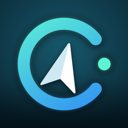
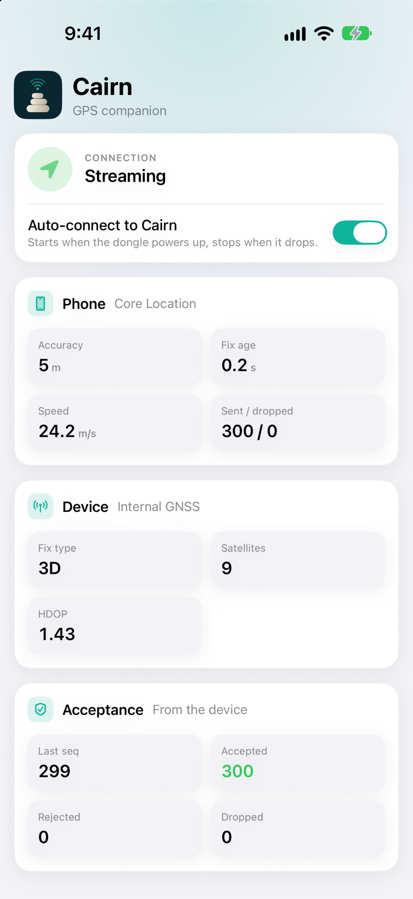
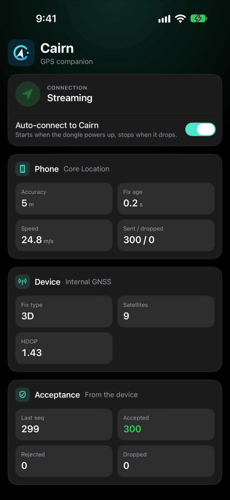
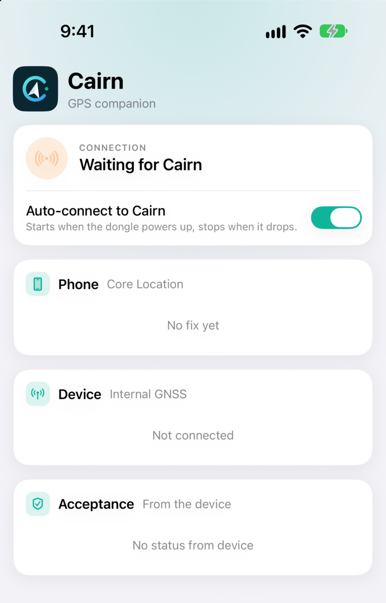
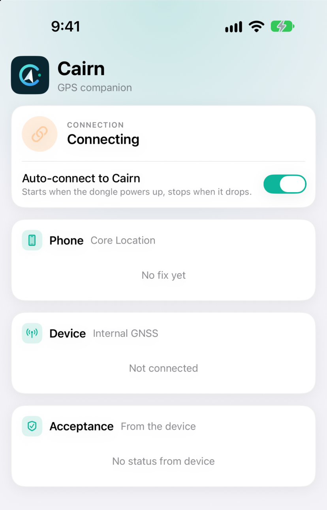
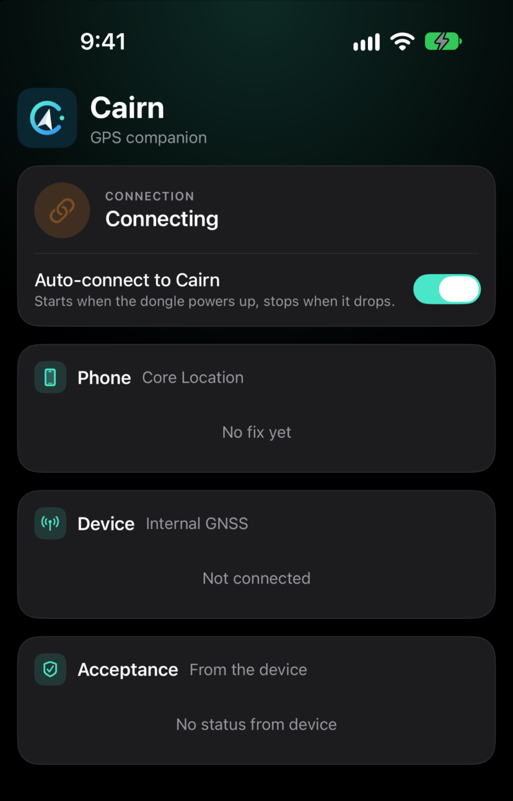
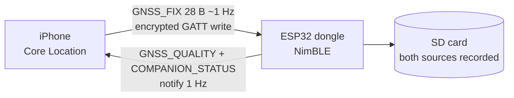
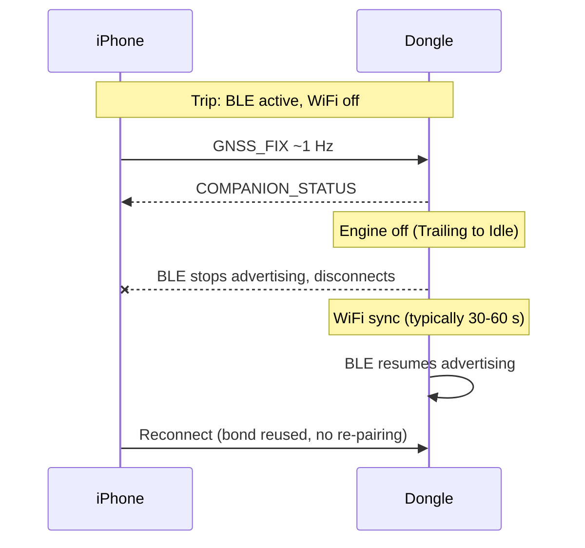

# Cairn Companion

**Your iPhone's GPS, streamed to an in-car ESP32 OBD-II logger over Bluetooth LE.**


An OBD-II port under the dash has almost no sky view. Cairn Companion turns the phone already on your windshield into the dongle's GPS: it forwards Core Location fixes, with per-fix accuracy, over an encrypted BLE link, and shows you whether the dongle actually accepted them. Companion to [Cairn](https://github.com/ParkWardRR/cairn-driving-log-selfhosted).

<p align="center">
  
  &nbsp;&nbsp;
  
</p>

> Screens above are simulator renders of the shipping UI with canned data ([how they are made](#regenerating-the-screenshots)). The BLE link itself runs on real hardware.

## Status

**Phase 1 is running on hardware.** The app builds and runs, bonds with the dongle, and streams fixes that the firmware accepts. The firmware side of Phase 1 is done: dual recording, phone-state clearing on disconnect, bond reset, and the golden vectors pass in its C tests. Still open: the full [validation matrix](docs/validation.md), including drive tests, background relaunch from a terminated app, and measured battery and write-rate.

Ahead of schedule, the app also has link-health indicators, a local drive History tab, and trip-snapshot sync from your Cairn server. The Phase 2 `OBD_LIVE` and `DEVICE_STATUS` cards are built but stay hidden until the firmware exposes those characteristics. See the [roadmap](docs/roadmap.md).

## Features

- **Zero-tap sessions.** The app holds a pending BLE connection to your dongle. When the car powers it up, location starts; when the link drops, location stops. No Start button.
- **Works locked or backgrounded.** `CLBackgroundActivitySession` plus `location` and `bluetooth-central` modes, with BLE state restoration.
- **Honest streaming indicator.** "Streaming" means the firmware acknowledged the fix via `COMPANION_STATUS`, not that the phone called `write`.
- **Invalid stays invalid.** Negative speed never becomes 0 cm/s, negative course never becomes north, accuracy is clamped instead of wrapped, and stale fixes are dropped before they reach the wire.
- **Secure by default.** Every characteristic requires an encrypted, authenticated link. The bond survives reboots, so there is no re-pairing.
- **Post-trip friendly.** When the dongle hands its radio to WiFi for sync, the app treats the disconnect as normal and reconnects when it advertises again.
- **Link health you can read.** Each card shows when it last heard from the dongle (live, stale, silent). After a drop the last readings stay on screen, dimmed, with a reconnect countdown and attempt count. A timeline strip shows drops this drive, and an ack bar shows sent versus accepted.
- **Drive history.** Every connection session is recorded on the phone: duration, streaming share, sent / accepted / rejected / dropped, reconnects, and the link event timeline. Short drops stay inside one drive; a gap over 10 minutes closes it. Interrupted sessions are recovered after the app is killed.
- **Trip sync from your server.** Point the app at your Cairn server in Settings and it downloads a snapshot of your trips (Parquet, loaded into an on-device DuckDB) for offline browsing, and merges the dongle's trip stats into each drive. The URL is stored on the device only.
- **Guided pairing and diagnostics.** A connection guide explains each status and walks through re-pairing after a stale bond. A persistent `cairn-drive.log` is shareable from the Files app.

## States

<table>
  <tr>
    <td align="center"><br><sub><b>Waiting</b><br>armed, dongle not in range</sub></td>
    <td align="center"><br><sub><b>Reconnecting</b><br>dongle is syncing over WiFi</sub></td>
    <td align="center"><br><sub><b>Dark mode</b><br>follows the system setting</sub></td>
  </tr>
</table>

## Problem

The OBD-II port sits near the driver's feet. The dongle's internal GNSS receiver is behind a co-processor link under the dash, so lock is slow and `DEGRADED_GNSS` is frequent. It also reports no accuracy:

| Field in `GNSS_SAMPLE` | Internal receiver today |
|---|---|
| `h_acc_cm`, `v_acc_cm` | always `0xFFFF` (unknown) |
| `sats_visible` | always unknown |
| `source_flags` | always `0` |

A phone on the windshield or dash has a better view of the sky and reports per-fix accuracy. Whether it is actually better in your car is a measurement, not an assumption.

## How it works



- The phone sends a validity- and age-stamped location; the firmware back-dates it to measurement time.
- Both receivers are written as separate `GNSS_SAMPLE` frames, tagged by `source_flags` bit 5. Nothing is fused or discarded.
- The app shows firmware acceptance (last seq, accepted / rejected / dropped), so "streaming" means the device took the fix.

### Drive lifecycle

BLE and WiFi share one radio, so the dongle hands it back and forth:



The app expects the post-trip disconnect, shows it as "Connecting" with a retry countdown, and reconnects on its own. COMPANION_STATUS counters restart on every connection, and so do the app's own sent and dropped counts.

## Design rules

| Rule | Why |
|---|---|
| Every fix carries `sample_age_ms`, `seq`, `validity_flags` | BLE receipt time is not measurement time; cached fixes must not look fresh |
| Invalid stays invalid (`0xFFFF` sentinels, clamped accuracy) | Negative `speed` must not become 0 cm/s; negative `course` must not become north |
| Recording is source-neutral; operational choices follow an explicit policy | Event position, trip speed, and health need defined rules |
| `DEGRADED_GNSS` = internal receiver health | The phone must not mask a hardware fault |
| Locked-screen driving session | A mounted phone is routinely locked or running Maps |
| All characteristics need an encrypted, authenticated link | Static passkey bonding; unbonded phones cannot inject fixes |
| No bundle format change | Only `source_flags` bit 5 is added; C, Go, Rust implementations unaffected |

## Stack

| | |
|---|---|
| App | Swift 6, SwiftUI, Observation, async/await, iOS 18+ |
| Location | `CLLocationUpdate.liveUpdates(.automotiveNavigation)`, `CLBackgroundActivitySession` |
| BLE (phone) | CoreBluetooth central, state restoration |
| BLE (dongle) | NimBLE-Arduino 2.2.x on ESP32 (Freematics ONE+ Model B) |
| Wire format | Little-endian fixed binary, one message type per characteristic |
| Trip data | [duckdb-swift](https://github.com/duckdb/duckdb-swift) over a downloaded Parquet snapshot, plain tar (Parquet is already compressed) |
| Local history | `Codable` JSON, one file per drive, in Application Support |

## Getting started

Requires Xcode 16+, an iPhone on iOS 18+ (BLE does not run in the simulator), [XcodeGen](https://github.com/yonaskolb/XcodeGen), and a dongle running the [Cairn firmware](https://github.com/ParkWardRR/cairn-esp32-device-firmware) with `CAIRN_BLE_COMPANION`.

```sh
cd CairnCompanion
cp Config/Local.xcconfig.example Config/Local.xcconfig   # set your bundle ID and team ID
xcodegen generate
open CairnCompanion.xcodeproj
```

Build and run on a device. For trip history, enter your Cairn server URL under **Settings** (it stays on the device). On first launch, grant **Always** location access (needed to start streaming from a background BLE wake) and Bluetooth. The first read of an encrypted characteristic makes iOS ask for the dongle's 6-digit passkey; after that, reconnects are silent. If the dongle's bond is reset, forget "Cairn" under Settings > Bluetooth first.

> **v3 note:** The v3 architecture will replace the manual server URL setting with enrolled-client identity. The app will generate a Secure Enclave P-256 key, enrol with the server, and sign every request. See the [v3 roadmap](docs/roadmap.md#v3--authenticated-sync-and-multi-vehicle).

Run the protocol tests, which need no radio or GPS:

```sh
cd CairnCompanion && swift test
```

### Regenerating the screenshots

Debug builds accept `CAIRN_DEMO=streaming|waiting|syncing|failed|staleBond|dropped|silent`, which seeds the UI with canned state so it can be captured in the simulator (`CAIRN_DEMO_SCALE=0.84` fits the full page on one screen):

```sh
SIMCTL_CHILD_CAIRN_DEMO=streaming SIMCTL_CHILD_CAIRN_DEMO_SCALE=0.84 \
  xcrun simctl launch booted <your.bundle.id>
xcrun simctl io booted screenshot docs/images/streaming-light.png
```

## Roadmap

| Phase | Scope | Status |
|---|---|---|
| **0 — Design** | Plan, protocol v1, design review, validation matrix | ✅ done |
| **1 — GPS reinforcement (MVP)** | iOS app + firmware: `GNSS_FIX`, `GNSS_QUALITY`, `COMPANION_STATUS`, bonding, dual recording, source-aware lifecycle, locked-screen session, DB compatibility | 🚧 running on hardware; validation in progress |
| **2 — Enrichment** | Barometric altitude, phone UTC, compass heading, OBD + trip state notify, live dashboard | 🚧 app side built for `BARO_ALT`, `UTC_SYNC`, `OBD_LIVE`, `DEVICE_STATUS`; waiting on firmware |
| **3 — Trips and history** | Local drive history, trip snapshot sync from your server, internal-vs-phone accuracy analysis, decide whether to power down internal GNSS when phone is connected | 🚧 history and snapshot sync built; not yet verified against a real server |
| **v3 — Authenticated sync and multi-vehicle** | Secure Enclave identity, per-request signing, vehicle-scoped data, durable outbox, LAN/Tailnet endpoint selection, BLE session auth | planned; see [v3 tracking issue](https://github.com/ParkWardRR/cairn-ios-companion-app/issues/13) |

Phase 1 exit criteria are the [validation matrix](docs/validation.md): security, stale/invalid handling, drive tests, DB compatibility, and measured RAM / stack / battery / write-rate. Per-item checklists live in [`docs/roadmap.md`](docs/roadmap.md).

## Docs

| Doc | Contents |
|---|---|
| [`docs/ble-protocol.md`](docs/ble-protocol.md) | GATT service, wire layouts, sentinels, staleness, session rules |
| [`docs/firmware-changes.md`](docs/firmware-changes.md) | ESP32 changes, source state, selection policy, `source_flags`, storage |
| [`docs/ios-app.md`](docs/ios-app.md) | Stack, screen, background session, radio handover, encoding rules, layout |
| [`docs/validation.md`](docs/validation.md) | Acceptance tests |
| [`docs/roadmap.md`](docs/roadmap.md) | Phase checklists |
| [`docs/decisions.md`](docs/decisions.md) | Decisions, design-review changes, open questions |
| [`docs/plan-link-health-and-history.md`](docs/plan-link-health-and-history.md) | Link-health UI and History tab plan |
| [`HANDOFF-FIRMWARE.md`](HANDOFF-FIRMWARE.md) | Firmware work list and the firmware repo's response |
| [v3 tracking issue](https://github.com/ParkWardRR/cairn-ios-companion-app/issues/13) | v3 authenticated sync and multi-vehicle |
| [`docs/full-plan.md`](docs/full-plan.md) | Complete original plan document |

## Contributing

Open an issue before large changes. Protocol changes must also update the firmware repo's copy of the spec and the shared golden vectors. No secrets in the repo: passkeys and hostnames belong in the gitignored firmware `secrets.h`, and signing values in the gitignored `Config/Local.xcconfig`.

## License

[Blue Oak Model License 1.0.0](LICENSE)
